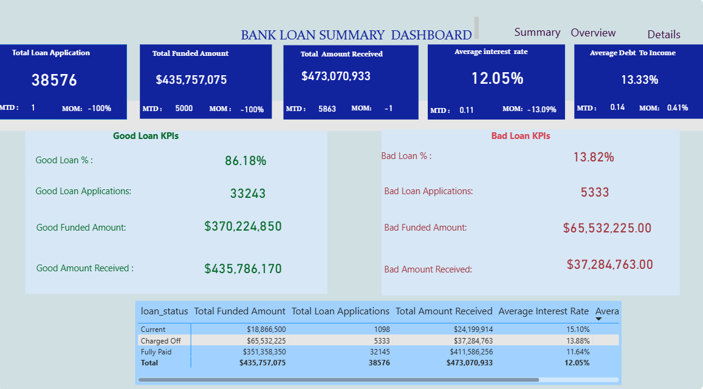
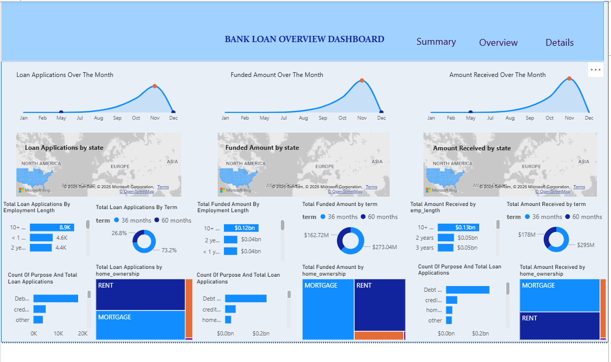
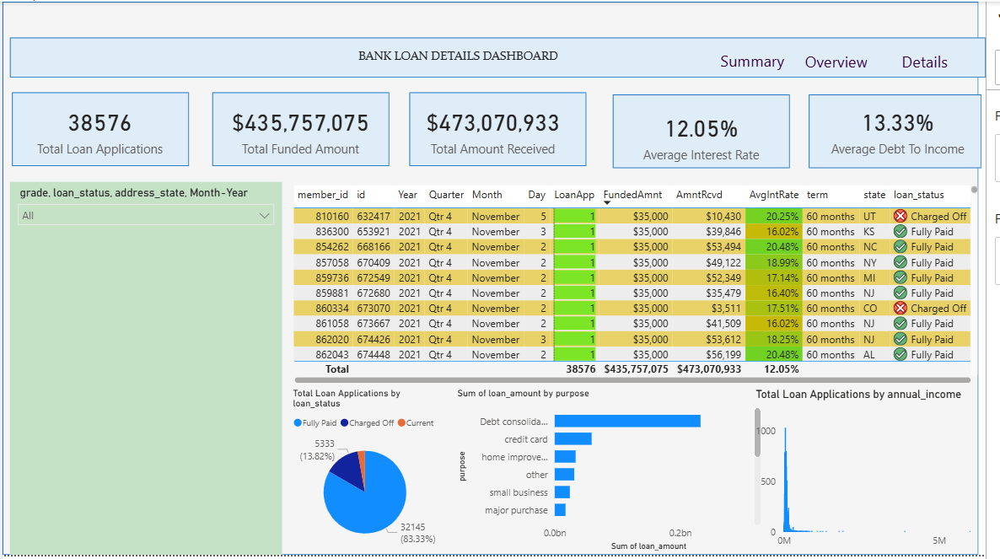

# 📊 Bank Loan Analysis – Power BI Project


> A comprehensive **Power BI dashboard** to analyze bank loan applications, funded amounts, repayments, and borrower insights.  
> Includes **3 interactive dashboards** (Summary, Overview, Details) with Good vs. Bad loan KPIs, regional analysis, and borrower trends.  

---

## 📑 Table of Contents
- [📌 Project Overview](#-project-overview)  
- [🎯 Problem Statement](#-problem-statement)  
- [📌 Key Performance Indicators (KPIs)](#-key-performance-indicators-kpis)  
- [📊 Dashboard Previews](#-dashboard-previews)  
- [🛠 Tools & Technologies](#-tools--technologies)  
- [📂 Repository Structure](#-repository-structure)  
- [🚀 How to Use](#-how-to-use)  
- [📈 Insights & Learnings](#-insights--learnings)  
- [📌 Future Enhancements](#-future-enhancements)  
- [👤 Author](#-author)  

---

## 📌 Project Overview  
This project focuses on analyzing a bank’s lending activities using **Power BI**.  
The objective is to monitor loan performance, track repayments, and identify trends across borrowers, loan terms, and regions. The dashboards provide **actionable insights** that support data-driven decisions and strategic planning.  

The analysis is divided into **three interactive dashboards**:  
1. **Summary Dashboard** – Key KPIs, loan health, and portfolio quality  
2. **Overview Dashboard** – Trends, regional performance, borrower analysis  
3. **Details Dashboard** – Loan-level drilldowns and borrower profiles  

---

## 🎯 Problem Statement  
Banks need a clear and consolidated view of their loan portfolio to:  
- Monitor **total loan applications, funded amounts, and repayments**  
- Assess the quality of loans (**Good vs. Bad**)  
- Track **repayment efficiency and borrower risk**  
- Visualize loan distribution across **terms, regions, employment length, loan purposes, and home ownership**  

This project solves the problem by building **interactive Power BI dashboards** powered by real financial loan data.  

---

## 📌 Key Performance Indicators (KPIs)  

### General KPIs  
- Total Loan Applications (with **MTD** and **MoM** trends)  
- Total Funded Amount (disbursed loans)  
- Total Amount Received (repayments)  
- Average Interest Rate  
- Average Debt-to-Income (DTI) Ratio  

### Good vs. Bad Loan KPIs  
**Good Loans** = Fully Paid + Current  
**Bad Loans** = Charged Off  

- % of Good vs. Bad Loan Applications  
- Funded Amount (Good vs. Bad)  
- Amount Received (Good vs. Bad)  

---

## 📊 Dashboard Previews  

### 🔹 Summary Dashboard  
  

### 🔹 Overview Dashboard  
  

### 🔹 Details Dashboard  
  

---

## 🛠 Tools & Technologies  
- **Power BI** – Data modeling & visualization  
- **Excel/CSV** – Source dataset (`financial_loan.csv`)  
- **DAX** – Calculated measures & KPIs  
- **GitHub** – Project documentation  

---

## 📂 Repository Structure  
├── images/
│ ├── summary_dashboard.png
│ ├── overview_dashboard.png
│ ├── details_dashboard.png
├── financial_loan.csv # Raw dataset
├── bank_loan.pbix # Power BI report file
├── Problem Statement.docx # Business problem & requirements
└── README.md # Project documentation

---

## 🚀 How to Use  
1. Clone this repository  
   ```bash
   git clone https://github.com/yourusername/bankloan-powerbi-project.git 
Open bank_loan.pbix in Power BI Desktop

Interact with the dashboards (filters, slicers, drilldowns)

Explore insights by region, borrower type, loan purpose, and more

---

## 📈 Insights & Learnings
Seasonal patterns in loan applications and disbursements

Higher loan applications concentrated in specific states

Employment length and home ownership strongly influence loan approval

A measurable portion of loans are charged-off (bad loans), impacting profitability

---

## 📌 Future Enhancements
Add predictive modeling (loan default risk) using Python + Power BI

Automate dataset refresh with Power BI Service

Expand dashboard with borrower credit score analysis

---

## 👤 Author
Name: Ige Tolulope

💼 LinkedIn
- [LinkedIn](https://www.linkedin.com/in/empress-oluwaseun-b4850a142)  

🐙 GitHub
- [GitHub](https://github.com/empress007)


